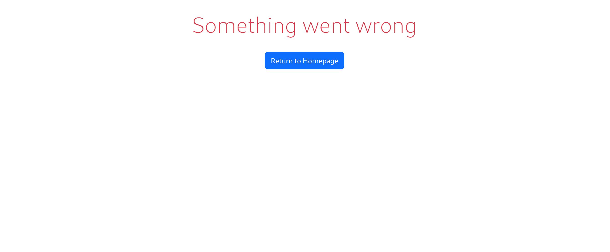

# MultiLanguageTranslator


## Overview

**MultiLanguageTranslator** is a Java-based web application designed to translate sets of words using an external translation Yandex Translate API. 

The application handles translation requests concurrently, managing up to 10 threads at a time, and supports efficient error handling and retry mechanisms. Translation history is stored in a PostgreSQL database using pure JDBC. The application is structured to be robust, scalable.

The application supports multiple languages and provides an easy-to-use RESTful API interface for clients.

## Features

- **Multithreaded Translation Requests**: The application sends translation requests concurrently, adhering to API rate limits.
- **Custom Error Handling**: The application handles various HTTP errors. If an error occurs during translation, the application retries the request up to a maximum number of attempts if the error is related to rate limiting.
- **Translation History**: Saves translation history to a PostgreSQL database.
- **REST API**: Provides endpoints for translating text and retrieving supported languages.
- **Web Interface**: Allows users to translate text directly from the browser.

## Technologies Used

- **Java** (JDK 21) : Core languages used for development.
- **Spring Boot** (3.2.5): Framework for building the application.
- **Gradle** (8.6): Automatic build system
- **PostgreSQL** (16): Database for storing translation history.
- **JDBC**: For database interaction.
- **RestTemplate**: For making HTTP requests to the translation API.
- **Thymeleaf** (for HTML templating)
- **JUnit 5**: For writing unit  tests.
- **Docker**: Used for running PostgreSQL.

## Getting Started

### Prerequisites

- Java 
- Gradle 
- PostgreSQL 
- Docker  (optional, for easier setup of the PostgreSQL database)

### Clone the Repository

```bash
git clone https://github.com/PchyolkaZloy/MultiLanguageTranslator.git
cd MultiLanguageTranslator
```

### Set Up the Database
1. Update the `database.properties` file in `dao` project with your PostgreSQL database credentials:

   ```properties
    jdbc.url=jdbc:postgresql://localhost:5432/your_db
    jdbc.username=yourusername
    jdbc.password=yourusername
    jdbc.pool.size.init=10
    jdbc.pool.size.max=15
    jdbc.timeout.max=60
   ```
2. Set up the PostgreSQL database:

    - You can use Docker to quickly build a PostgreSQL instance.
    - Use docker-compose.yml already written
     ```bash
    docker-compose up --build -d
    ```
3. Apply SQL scripts located in `dao/src/main/resources/init.sql` to set up the necessary tables.
### Set Up the API key
Update the `application.properties` file in `service` project with your Yandex Translate API key (Check [documentation](https://yandex.cloud/en/docs/translate/) about this API):

   ```properties
    translation.api.url.translate=https://translate.api.cloud.yandex.net/translate/v2/translate
    translation.api.url.languages=https://translate.api.cloud.yandex.net/translate/v2/languages
    translation.api.key=yourkey
    translation.thread.limit=10
    translation.translation.limit=20
   ```

### Build and Run the Application

To build and run the application, use the following Gradle commands:

```bash
./gradlew build
./gradlew bootRun
```

The application will start on `http://localhost:8080`.

## Usage
### REST API
The REST API is accessible at `/api/v1/`. Below are the available endpoints:
### 1. Translate Text

- **URL**: `/api/v1/translate`
- **Method**: `POST`
- **Description**: Translates a text from one language to another.

#### Request Body

```json
{
  "sourceCode": "en",
  "targetCode": "es",
  "text": "Hello World"
}
```

- `sourceCode`: The source language code (e.g., "en" for English).
- `targetCode`: The target language code (e.g., "es" for Spanish).
- `text`: The text to be translated.

#### Response

**Success**: Returns the translated text.

```json
{
  "translatedText": "Hola Mundo"
}
```

**Error**: Returns an error message and status code.

```json
{
  "status": 400,
  "message": "The source language was not found. See /translator/languages for a list of available languages and their codes"
}
```

### 2. Get Supported Languages

- **URL**: `/api/v1/languages`
- **Method**: `GET`
- **Description**: Retrieves a list of languages supported by the translation API.

#### Response

```json
{
  "languages": [
    { "code": "en", "name": "English" },
    { "code": "es", "name": "español" }
  ]
}
```

### Web Interface

The web interface is accessible at the root URL `/`.

- **Main Page**: Users can select source and target languages, input text, and view the translated result.
- **Error Page**: Redirects to an error page if the translation fails.

### Screenshots

#### Main Page


#### Error Page


## Testing

To run the tests, use the following Gradle command:

```bash
./gradlew test
```

The tests include unit tests for the controller and DAO layers using Spring.


## License

This project is licensed under the MIT License. See the [LICENSE](LICENSE) file for details.
